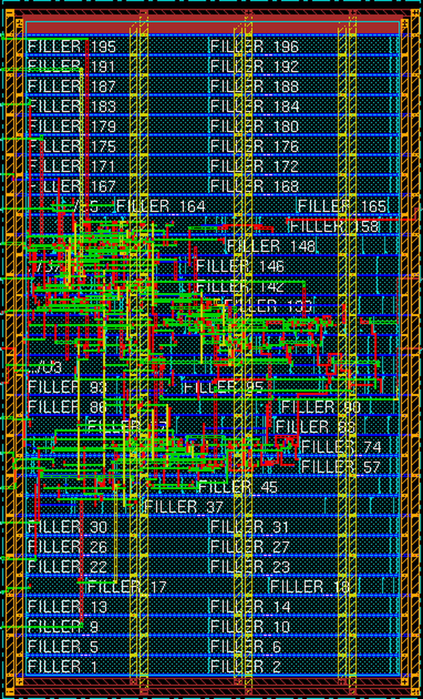
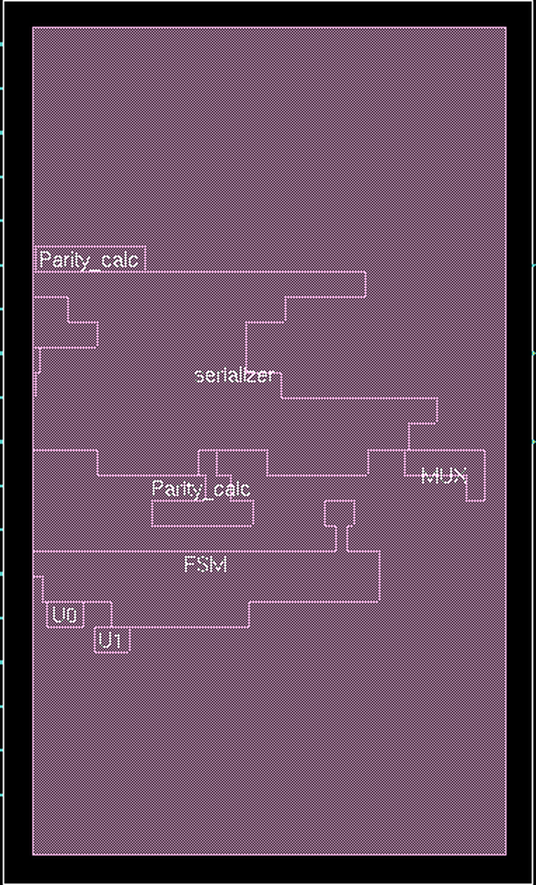
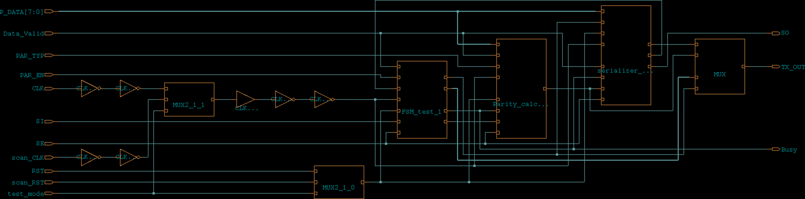

# UART_TX


A UART Transmitter design I implemented in Verilog/SystemVerilog, verified with a self-checking testbench, synthesized using Synopsys Design Compiler, hardened for manufacturing test with a full-scan DFT insertion flow, and carried all the way through physical implementation to a **GDSII layout** in Cadence Encounter/Innovus.

## Table of Contents

- [About the Design](#about-the-design)
- [Repository Structure](#repository-structure)
- [Schematics](#schematics)
- [Synthesis Summary (Functional)](#synthesis-summary-functional)
- [Design for Test (DFT)](#design-for-test-dft)
- [Physical Design (Place & Route)](#physical-design-place--route)
- [Design Flow Summary](#design-flow-summary)
- [Verification](#verification)
- [Tools Used](#tools-used)

## About the Design

The transmitter converts an 8-bit parallel data byte into a serial UART frame (start bit → data bits → optional parity bit → stop bit). It's built from four functional sub-modules controlled by a main FSM:

- **FSM** – controls the transmission sequence
- **serializer** – shifts out the data bits
- **Parity_calc** – generates the parity bit (even/odd, configurable)
- **MUX** – selects which bit drives the output line

Configuration is done through `PAR_EN` (enable/disable parity) and `PAR_TYP` (even/odd), and a `Busy` flag indicates when a transmission is in progress.

For testability, the top level also includes a **test/scan clock and reset mux** (`MUX2_1`), which lets the DFT flow drive the core FSM, serializer, and parity registers from `scan_CLK`/`scan_RST` instead of the functional `CLK`/`RST` whenever `test_mode` is asserted. This is the only structural change made to the RTL for DFT — the functional logic and behavior are untouched.

## Repository Structure

```
rtl/                        → design source files (functional + DFT scan/reset mux)
tb/                         → testbench and simulation scripts
lint_reports/               → lint check report
sim_reports/                → testbench pass/fail log
synthesis/
  scripts/                  → Design Compiler synthesis script (functional-only netlist)
  constraints/               → SDC/SDF files
  netlist/                  → gate-level netlist and .ddc
  reports/                  → area, timing, power, and synthesis log
  formality/                 → formal verification (RTL vs. functional netlist)
    fm_script.tcl
    fm.log
    reports/                 → passing/failing/aborted/unverified points
dft/
  scripts/                  → DFT-ready synthesis script (dft_script.tcl) and DFT constraints (cons.tcl)
  constraints/               → scan-aware SDC/SDF
  netlist/                  → scan-inserted gate-level netlist, .ddc, and Formality .svf
  reports/                  → area, power, timing, ports, DFT DRC, and coverage-estimate reports
  formality/                 → formal verification (RTL vs. scan-inserted netlist)
    fm_script.tcl
    fm.log
    reports/                 → passing/failing/aborted/unverified points
docs/images/                 → schematics for the functional design
docs/dft_images/             → schematics (PNG) for the scan-inserted design
docs/pnr_images/             → floorplan/placement/routing views from the PNR flow
pnr/
  scripts/                  → Cadence Encounter/Innovus PNR scripts (import → floorplan → placement → CTS → routing → chip finish → outputs)
  import/                  → design LEF (pin abstract), MMMC view, and GDS layer map used for import
  export/                  → post-PNR GDSII, gate-level netlist (with/without PG pins), SDF, and SPF parasitics
  reports/                  → geometry/connectivity/antenna verification and setup/hold timing summaries
```

## Schematics

<table>
<tr>
<td align="center"><b>Top-level view</b></td>
<td align="center"><b>Internal RTL view</b></td>
<td align="center"><b>Scan-inserted top-level view</b></td>
</tr>
<tr>
<td></td>
<td></td>
<td></td>
</tr>
</table>

## Synthesis Summary (Functional)

Synthesized with **Synopsys Design Compiler (O-2018.06-SP1)** using the `scmetro_tsmc_cl013g_rvt` standard-cell library.

| Metric                 | Value        |
|------------------------|--------------|
| Total cell area        | 827.22 µm²   |
| Number of cells        | 81           |
| Sequential cells       | 15           |
| Combinational cells    | 62           |
| Total power            | 5.48e-04 mW  |

Full breakdown is available in [`synthesis/reports/Area.rpt`](synthesis/reports/Area.rpt) and [`synthesis/reports/power.rpt`](synthesis/reports/power.rpt).

## Design for Test (DFT)

The design was made scan-testable using **Synopsys DFT Compiler**, on top of the same RTL plus the `MUX2_1`-based scan clock/reset muxing described above.

**Test ports added at the top level:**

| Port        | Direction | Function                                               |
|-------------|-----------|---------------------------------------------------------|
| `test_mode` | in        | Selects functional (`0`) vs. test (`1`) clock/reset      |
| `scan_CLK`  | in        | Scan-mode clock, muxed onto the core clock in test mode  |
| `scan_RST`  | in        | Scan-mode reset, muxed onto the core reset in test mode  |
| `SE`        | in        | Scan enable                                              |
| `SI`        | in        | Scan chain data in                                       |
| `SO`        | out       | Scan chain data out                                      |

**Scan architecture:**

- 1 scan chain, 15 cells deep — every sequential cell in the design (`FSM` state bits, `serializer` shift register and counter, `Parity_calc`'s parity register) is a valid scan cell.
- Chain clocked by `scan_CLK` (500 ns capture, 1000 ns period).
- Functional and scan clocks are declared as a logically exclusive clock group; `test_mode` is tied off (`set_case_analysis 0`) for functional-mode timing closure.

**Post-DFT results:**

| Metric                         | Value        |
|---------------------------------|--------------|
| Total cell area                 | 994.31 µm²   |
| Number of cells                 | 92           |
| Sequential cells                | 15           |
| Combinational cells             | 71           |
| Total power                     | 8.14e-04 mW  |
| DFT DRC violations              | 0            |
| Scan cells without violations   | 15 / 15      |
| **Test coverage (estimate)**    | **98.46%**   |

Out of 714 total collapsed faults: 702 detected, 11 ATPG-untestable, 1 undetectable, 0 not-detected. This is a **strong result for an initial single-chain scan insertion** — the faults left uncovered are ATPG-untestable/undetectable nodes rather than untested-but-testable logic, so there's no low-hanging fruit left to pick up without redesigning that logic. Coverage could still be pushed closer to 100% with a dedicated, simulated ATPG pattern set (this report is DFT Compiler's built-in coverage *estimate*, not a signed-off ATPG run) or by reviewing the 11 untestable faults individually.

Full detail is available in [`dft/reports/dft_drc_post_dft.rpt`](dft/reports/dft_drc_post_dft.rpt), [`dft/reports/Area.rpt`](dft/reports/Area.rpt), and [`dft/reports/power.rpt`](dft/reports/power.rpt).

**Post-DFT formal equivalence:** the scan-inserted netlist was re-verified against the RTL (with `test_mode` and `SE` held at `0`, and `SO` excluded as a scan-only port) using Synopsys Formality — **17/17 compare points passing, 0 failing, 0 aborted, 0 unverified**. See [`dft/formality/fm_script.tcl`](dft/formality/fm_script.tcl) and [`dft/formality/reports/`](dft/formality/reports/).

## Physical Design (Place & Route)

The scan-inserted, DFT-ready netlist was taken through a full RTL-to-GDSII flow in **Cadence Encounter/Innovus**, targeting the same `tsmc13fsg` (TSMC 0.13 µm) technology as the standard-cell library used for synthesis and DFT.

**Flow stages** (see [`pnr/scripts/`](pnr/scripts/)):

1. **Design import** ([`des_import.tcl`](pnr/scripts/des_import.tcl)) — loads the post-DFT gate-level netlist, `min`/`max`/`typ` timing libraries, tech + macro + design LEF, capacitance table, and the functional SDC.
2. **Floorplan** ([`floorplan.tcl`](pnr/scripts/floorplan.tcl)) — defines a 60 µm × 100 µm core with a 3 µm core-to-die margin on all sides, matching the pin layout in the custom design LEF ([`pnr/import/UART_TX.lef`](pnr/import/UART_TX.lef)).
3. **Power planning** — a VDD/VSS power ring around the core plus vertical power stripes on METAL4 (perpendicular to the horizontal standard-cell rows) for even IR-drop distribution, followed by special routing (`sroute`) to connect rings, stripes, and standard-cell rails.
4. **Placement** ([`placement.tcl`](pnr/scripts/placement.tcl)) — standard-cell placement with in-place/pre-place optimization, plus tie-hi/lo cell insertion and global VDD/VSS net connection.
5. **Clock Tree Synthesis** ([`cts.tcl`](pnr/scripts/cts.tcl)) — clock tree built and balanced from the generated `Clock.ctstch` spec.
6. **Routing** ([`routing.tcl`](pnr/scripts/routing.tcl)) — global + detailed routing up to METAL6, with via and wire optimization.
7. **Chip finishing** ([`chip_finish.tcl`](pnr/scripts/chip_finish.tcl)) — **198 filler cells** inserted to close the core rows.
8. **Output generation** ([`outputs_gen.tcl`](pnr/scripts/outputs_gen.tcl)) — final GDSII, post-PNR netlists (with/without PG pins), SDF, SPF, and a power report exported to [`pnr/export/`](pnr/export/).

**Physical verification** — all clean, 0 violations:

| Check                     | Result              |
|----------------------------|---------------------|
| Geometry DRC (`verifyGeometry`)     | 0 violations |
| Connectivity (`verifyConnectivity`) | 0 problems, 0 warnings |
| Process antenna (`verifyProcessAntenna`) | 0 violations |

Full reports: [`pnr/reports/UART_TX.geom.rpt`](pnr/reports/UART_TX.geom.rpt), [`pnr/reports/UART_TX.conn.rpt`](pnr/reports/UART_TX.conn.rpt), [`pnr/reports/UART_TX.antenna.rpt`](pnr/reports/UART_TX.antenna.rpt).

**Post-route static timing:**

| Metric                  | Setup                | Hold                 |
|--------------------------|-----------------------|-----------------------|
| WNS                       | 698.512 ns            | 0.110 ns              |
| TNS                       | 0.000 ns               | 0.000 ns               |
| Violating paths           | 0 / 48                 | 0 / 48                 |
| Core density              | 22.114%                | 22.114%                |

Timing closes with a comfortable positive margin at both corners — expected for a small, low-frequency design (994 µm² of standard cells inside a 60 µm × 100 µm core). Full summaries: [`pnr/reports/timingReports/`](pnr/reports/timingReports/).

**Layout views:**

<table>
<tr>
<td align="center"><b>Floorplan — power stripes & filler cells</b></td>
<td align="center"><b>Post-placement view</b></td>
</tr>
<tr>
<td></td>
<td></td>
</tr>
</table>

**Routed design — top-level schematic view:**



**PNR deliverables:** [`pnr/export/UART_TX.gds`](pnr/export/UART_TX.gds) (final layout), [`pnr/export/UART_TX.v`](pnr/export/UART_TX.v) / [`UART_TX_pg.v`](pnr/export/UART_TX_pg.v) (post-PNR netlist), [`pnr/export/UART_TX.sdf`](pnr/export/UART_TX.sdf) (back-annotated delays), [`pnr/export/UART_TX.spf`](pnr/export/UART_TX.spf) (extracted parasitics).

## Design Flow Summary

How the design evolves across the flow, stage by stage:

| Stage                | Tool                              | Cell Area   | # Cells | Total Power  | Key Result                          |
|-----------------------|------------------------------------|-------------|---------|--------------|---------------------------------------|
| RTL → Synthesis       | Synopsys Design Compiler          | 827.22 µm²  | 81      | 5.48e-04 mW  | 17/17 formal points passing           |
| + DFT (scan insertion)| Synopsys DFT Compiler             | 994.31 µm²  | 92      | 8.14e-04 mW  | 98.46% coverage, 0 DRC violations     |
| + Place & Route       | Cadence Encounter/Innovus         | 60×100 µm core, 22.1% density, 198 fillers | — | — | 0 physical violations, timing closed |

Every stage is independently formally/physically verified before moving to the next — see [Verification](#verification) below.

## Verification

- Functional simulation with a self-checking testbench (ModelSim/QuestaSim) — see [`sim_reports/test_log.txt`](sim_reports/test_log.txt)
- Formal equivalence checking, RTL vs. functional gate-level netlist, using Synopsys Formality — **17/17 compare points passing** (see [`synthesis/formality/`](synthesis/formality/))
- Formal equivalence checking, RTL vs. scan-inserted (post-DFT) netlist, using Synopsys Formality — **17/17 compare points passing** (see [`dft/formality/`](dft/formality/))
- Physical verification (DRC/connectivity/antenna) post-route, using Cadence Encounter/Innovus — **0 violations** (see [`pnr/reports/`](pnr/reports/))

## Tools Used

- Simulation: ModelSim/QuestaSim
- Synthesis: Synopsys Design Compiler
- DFT: Synopsys DFT Compiler
- Formal Verification: Synopsys Formality
- Place & Route: Cadence Encounter/Innovus
